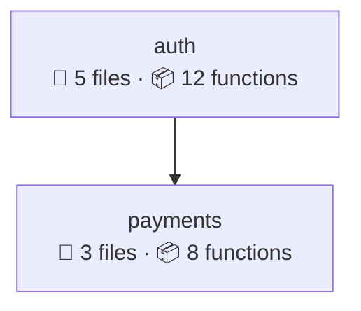

# @getmikk/diagram-generator

> Mermaid.js diagram generation — produces architecture, flow, health, impact, capsule, and dependency matrix visualizations from your codebase's lock file.

[](https://www.npmjs.com/package/@getmikk/diagram-generator)
[](../../LICENSE)

`@getmikk/diagram-generator` turns the `mikk.json` contract and `mikk.lock.json` lock file into rich [Mermaid.js](https://mermaid.js.org/) diagrams. Every diagram is generated entirely from AST-derived data — no manual drawing required. Supports 7 diagram types covering everything from high-level architecture to per-function call flows.

---

## Installation

```bash
npm install @getmikk/diagram-generator
# or
bun add @getmikk/diagram-generator
```

**Peer dependency:** `@getmikk/core`

---

## Quick Start

```typescript
import { DiagramOrchestrator } from '@getmikk/diagram-generator'
import { ContractReader, LockReader } from '@getmikk/core'

const contract = await new ContractReader().read('./mikk.json')
const lock = await new LockReader().read('./mikk.lock.json')

const orchestrator = new DiagramOrchestrator(contract, lock, process.cwd())
const result = await orchestrator.generateAll()

console.log(result.generated) // List of generated .mmd file paths
// Files written to .mikk/diagrams/
```

---

## Diagram Types

### 1. Main Architecture Diagram

High-level `graph TD` showing all modules with file/function counts and inter-module edges.

```typescript
import { MainDiagramGenerator } from '@getmikk/diagram-generator'

const gen = new MainDiagramGenerator(contract, lock)
const mermaid = gen.generate()
```

**Output example:**



---

### 2. Module Detail Diagram

Zoomed-in per-module diagram showing file subgraphs, internal call edges, and external dependencies.

```typescript
import { ModuleDiagramGenerator } from '@getmikk/diagram-generator'

const gen = new ModuleDiagramGenerator(contract, lock)
const mermaid = gen.generate('auth') // module ID
```

Shows:
- Subgraphs for each file in the module
- Function nodes within each file
- Internal call edges between functions
- External call links to other modules

---

### 3. Impact Diagram

Visualizes the blast radius of changes — what's directly changed (red) vs. transitively impacted (orange).

```typescript
import { ImpactDiagramGenerator } from '@getmikk/diagram-generator'

const gen = new ImpactDiagramGenerator(lock)
const mermaid = gen.generate(
  ['auth/login.ts::validateToken'],   // changed node IDs
  ['payments/checkout.ts::processPayment'] // impacted node IDs
)
```

**Output:** `graph LR` with color-coded nodes:
- 🔴 **Red** — directly changed
- 🟠 **Orange** — transitively impacted
- Edges show the propagation chain

---

### 4. Health Dashboard

Module health overview with cohesion percentage, coupling count, function count, and color-coded status.

```typescript
import { HealthDiagramGenerator } from '@getmikk/diagram-generator'

const gen = new HealthDiagramGenerator(contract, lock)
const mermaid = gen.generate()
```

**Metrics per module:**

| Metric | Description |
|--------|-------------|
| Cohesion % | Ratio of internal calls to total calls (higher = better) |
| Coupling | Count of cross-module dependencies (lower = better) |
| Functions | Total function count |
| Health | 🟢 Green (>70% cohesion) · 🟡 Yellow (40-70%) · 🔴 Red (<40%) |

---

### 5. Flow Diagram (Sequence)

Traces a function's call chain as a Mermaid sequence diagram.

```typescript
import { FlowDiagramGenerator } from '@getmikk/diagram-generator'

const gen = new FlowDiagramGenerator(lock)

// Trace from a specific function
const sequence = gen.generate('auth/login.ts::handleLogin', /* maxDepth */ 5)

// Show all entry-point functions grouped by module
const entryPoints = gen.generateEntryPoints()
```

The sequence diagram follows the call graph depth-first, showing which function calls which, across module boundaries.

---

### 6. Capsule Diagram

Shows a module's public API surface — the "capsule" boundary:

```typescript
import { CapsuleDiagramGenerator } from '@getmikk/diagram-generator'

const gen = new CapsuleDiagramGenerator(contract, lock)
const mermaid = gen.generate('auth') // module ID
```

**Visualizes:**
- **Public functions** — exported and listed in the module's `publicApi`
- **Internal functions** — everything else
- **External consumers** — other modules that call into this module's public API

---

### 7. Dependency Matrix

N×N cross-module dependency analysis:

```typescript
import { DependencyMatrixGenerator } from '@getmikk/diagram-generator'

const gen = new DependencyMatrixGenerator(contract, lock)

// Mermaid graph with weighted edges
const graph = gen.generate()

// Markdown table (N×N matrix)
const table = gen.generateTable()
```

**Markdown table example:**

| | auth | payments | users |
|---|---|---|---|
| **auth** | — | 5 | 2 |
| **payments** | 1 | — | 3 |
| **users** | 0 | 0 | — |

Numbers represent cross-module function call counts.

---

## DiagramOrchestrator

The orchestrator generates all diagrams at once and writes them to `.mikk/diagrams/`:

```typescript
import { DiagramOrchestrator } from '@getmikk/diagram-generator'

const orchestrator = new DiagramOrchestrator(contract, lock, projectRoot)

// Generate everything
const result = await orchestrator.generateAll()
// Writes:
//   .mikk/diagrams/main.mmd
//   .mikk/diagrams/health.mmd
//   .mikk/diagrams/matrix.mmd
//   .mikk/diagrams/flow-entrypoints.mmd
//   .mikk/diagrams/module-{id}.mmd  (one per module)
//   .mikk/diagrams/capsule-{id}.mmd (one per module)

// Generate impact diagram for specific changes
const impactMmd = await orchestrator.generateImpact(changedIds, impactedIds)
// Writes: .mikk/diagrams/impact.mmd
```

**Output files:** All diagrams are `.mmd` files that can be rendered with:
- [Mermaid Live Editor](https://mermaid.live/)
- GitHub Markdown (native Mermaid support)
- VS Code Mermaid extensions
- `mmdc` CLI (mermaid-cli)

---

## Types

```typescript
import {
  DiagramOrchestrator,
  MainDiagramGenerator,
  ModuleDiagramGenerator,
  ImpactDiagramGenerator,
  HealthDiagramGenerator,
  FlowDiagramGenerator,
  CapsuleDiagramGenerator,
  DependencyMatrixGenerator,
} from '@getmikk/diagram-generator'
```

---

## License

[MIT](../../LICENSE)
